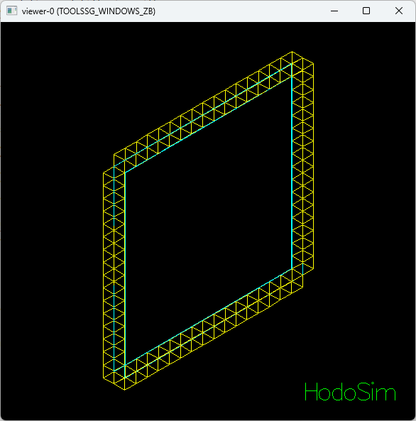
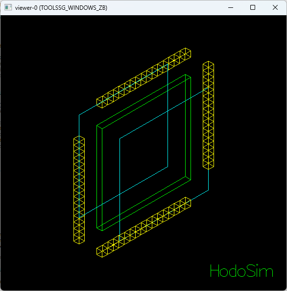
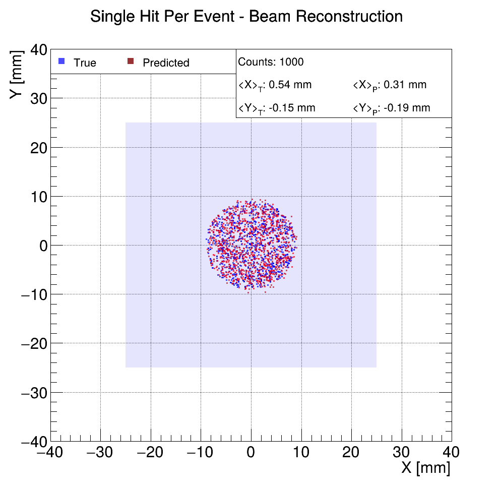
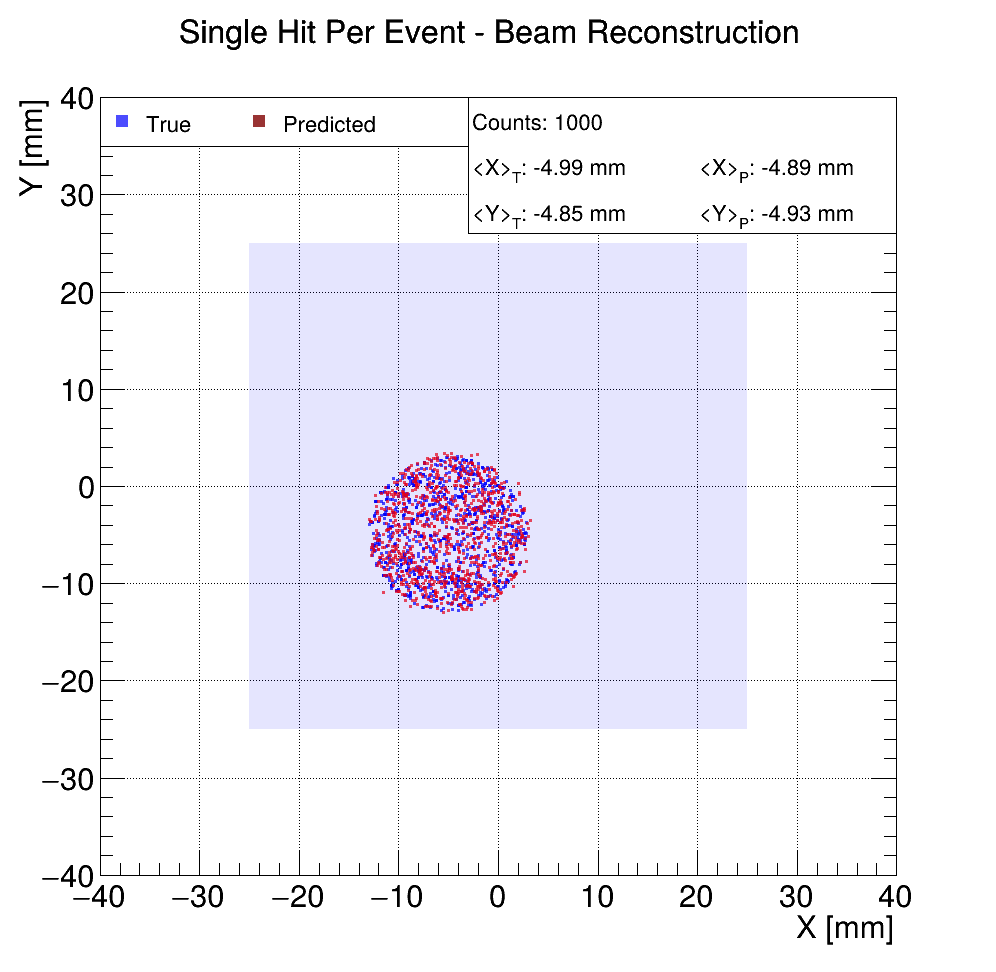
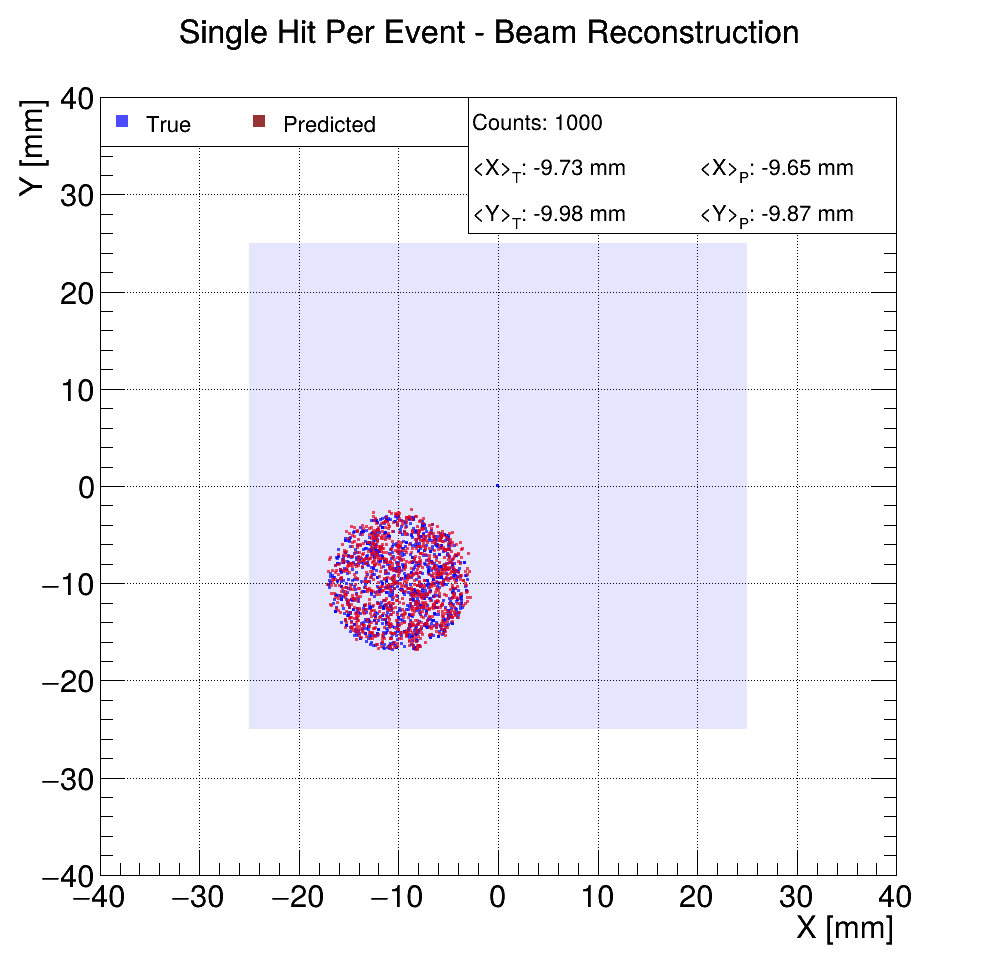
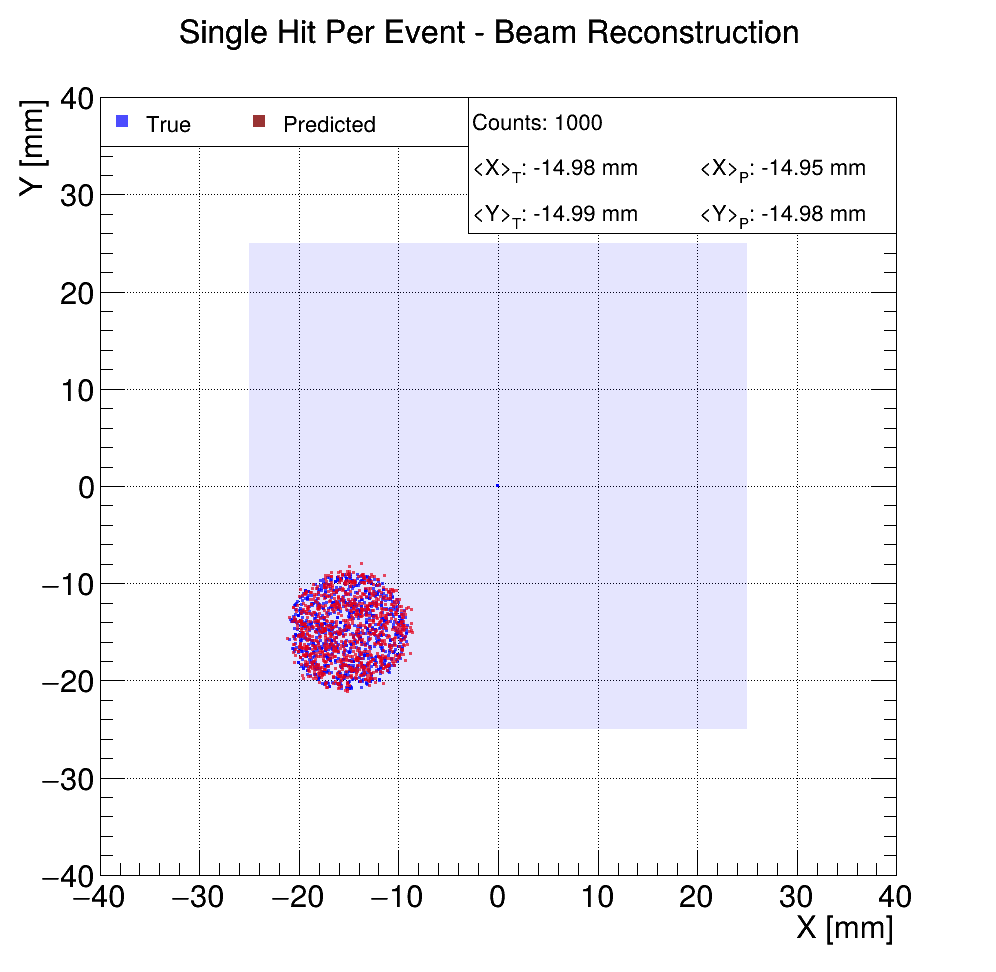
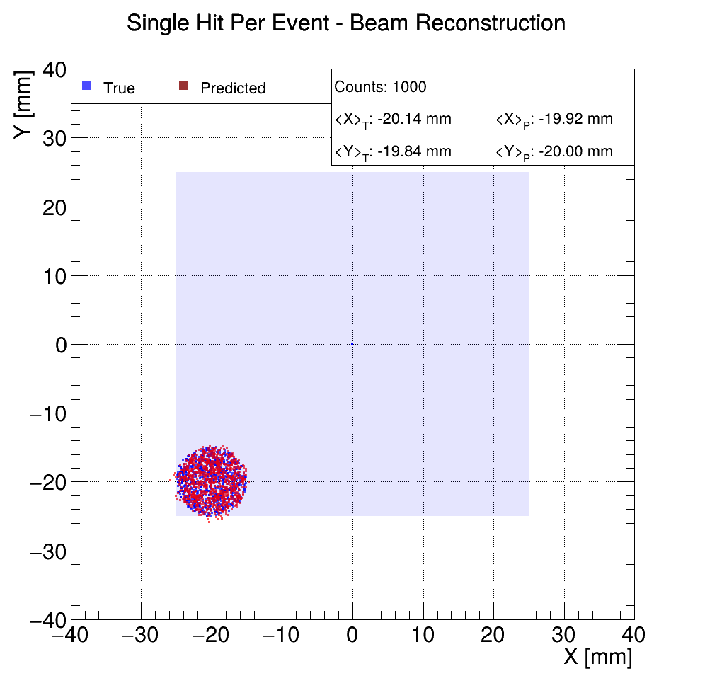
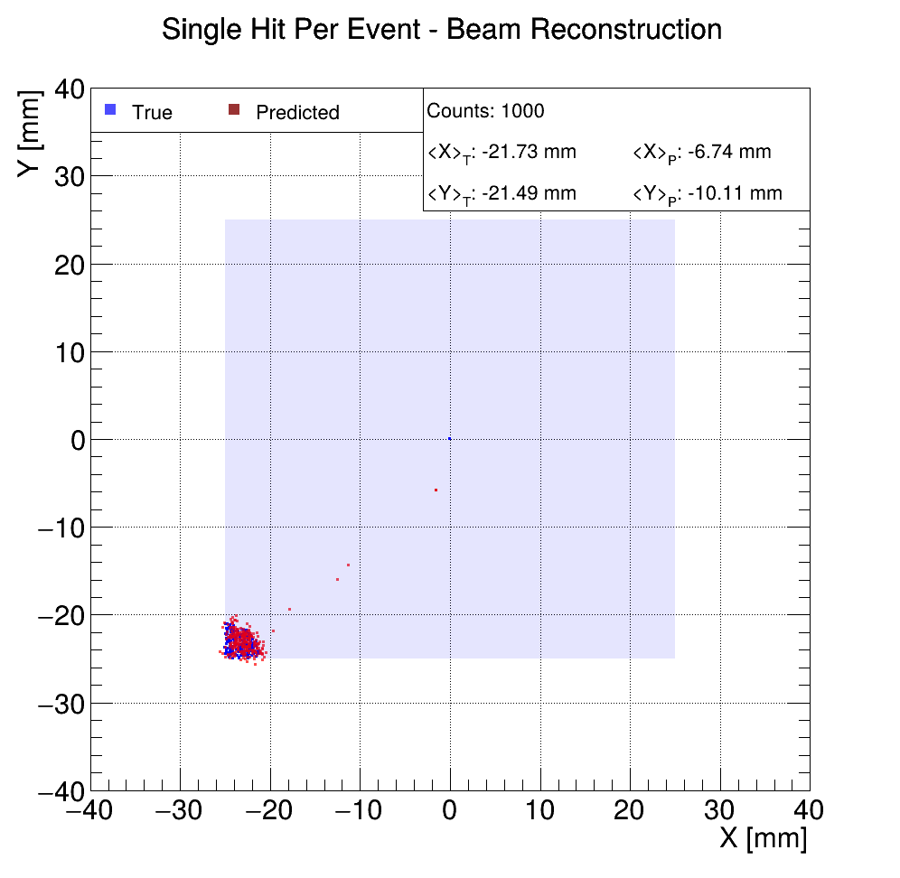



# Purposes

A Geant4 simulation of an hodoscope, used to monitor the properties of a muon beam.
The Scint+SiPM detector used in the simulation comes from the MuScinTest project, where it was accurately studied and verified.

In particular, for a fixed set of parameters such as 
- the configuration of the components of the hodoscope,
- the geometry of single components,
- the properties of the incoming beam

(primarily) i want to achieve 
- a good prediction power over the beam position/shape (and eventually its intensity) using the data collected by the hodoscope.
- a certain transparency to muons of different energies (to minimize the impact of the hodoscope on the beam itself).
- a consistent equivalence with real experimental data (once available).

# Dependencies

> **Geant4** (v11.3.0)

> **ROOT** (v6.32.10), to compile and run the PlotPredict app

> **rapidyaml** (v0.10.0), to parse YAML configuration files

> **ONNX Runtime** (v1.23.2), to run trained ML models in the PlotPredict app

# Results

Here are some preliminary results on beam reconstruction, using the proposed method (a simple feedforward neural network):

## Predictions on Single Hit Per Event Beams

# Implementation

With that in mind, there are multiple configurations that can be studied. 

## Single Plate Configuration

the first configuration i want to implement is the following: a single scintillator plate (BC-412) of size 50mm x 50mm x 3mm, coated on the front and back sides with a reflective layer 
(Aluminum) of thickness 50um, surrounded by 4xN SiPMs, positioned on the lateral sides of the plate.

This configuration's pro are that:
- relying on a single scintillator plate should lower the cost and complexity of the installation,
- the muons cross a minimal amount of material (thus losing less energy),
- the 4xN SiPMs should provide a good prediction power over the beam position and shape.

The Cons are that:
- the scintillator plate thickness is still bounded by the SiPMs thickness (1-3mm),
- it can't predict the beam intensity (muons at the surface per second).

# Output

Before proceeding i want to report some important considerations regarding data.

- A lot of space is required to sample single optical photons information (per-photon logs) (just imagine that for each MeV of the crossing particle, approx 10k optical photons are produced, 
the sim requires tens of thousands of muons to store enough data for other plots).
To avoid huge output files i suggest using histograms (and not NTuples) to sample optical photons.

I want to collect the following data:

**Scint/Cer Optical Photons Count (optical photons per event detect by a single SiPM)**:
this will be used to predict the beam position/shape/intensity.

**Total Energy Deposition by Component/Material & Particle Type (MeV)**:
this will be used to verify the transparency of the hodoscope to muons of different energies.

# Next Step

Each configuration proposed can undergo an optimization process using machine learning techniques (bayesian optimization, reinforcement learning, etc..).
This will not be covered in this project but i may explore this path later.

# History of Changes

- 2025-10-18: Initial commit, initialized the project starting from a clone of the MuScinTest project.
- 2025-10-26: Successfully updated the geometry to match the single plate configuration.
- 2025-11-02: Added support for AI powered beam position/shape predictions in the PlotPredict app.